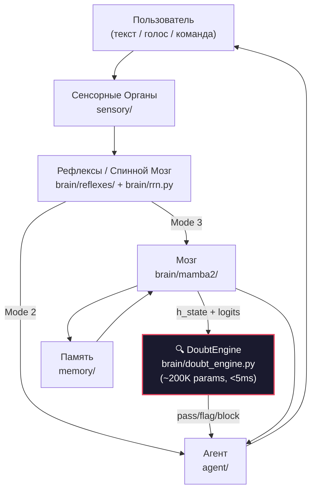

# ТАРС — Техническое Задание

> Живой документ. Два раздела: **текущее состояние** и **к чему стремимся**.
> Дополняется автором, используется при построении архитектуры.

---

## Часть 1. Текущее состояние (v3)

### 1.1 Что такое ТАРС

ТАРС — автономная ИИ-система с нервной системой из 4 уровней, гибридным мозгом (Mamba-2 + RWKV-7), многоуровневой памятью, рефлексами и сенсорными органами.

**Цель:** выполнять задачи от просьбы до результата, думая последовательно и проверяя себя.

---

### 1.2 Архитектура



---

### 1.3 Сенсорные Органы (`sensory/`)

Преобразуют внешний мир в понятные модели формат данных.

| Файл | Что делает |
|------|-----------|
| [`voice.py`](file:///c:/Users/Public/Tarsfull/TarsSSM-Py/sensory/voice.py) | Whisper STT — преобразование речи в текст. Поддержка потокового ввода, Silero VAD для определения начала/конца речи. |
| [`intonation_sensor.py`](file:///c:/Users/Public/Tarsfull/TarsSSM-Py/sensory/intonation_sensor.py) | Анализ эмоций в голосе — определяет тон, настроение, срочность. Передаёт эмоциональный контекст рефлексам. |
| [`vision.py`](file:///c:/Users/Public/Tarsfull/TarsSSM-Py/sensory/vision.py) | Анализ изображений — распознавание объектов, текста на картинках (OCR), визуальный контекст. |
| [`ssm_vad.py`](file:///c:/Users/Public/Tarsfull/TarsSSM-Py/sensory/ssm_vad.py) | Детектор голосовой активности на SSM — определяет, говорит ли пользователь, фильтрует шум. |

---

### 1.4 Рефлексы / Спинной мозг (`brain/reflexes/`, `brain/rrn.py`, `brain/spiking/`, `brain/min_gru/`)

Быстрая маршрутизация запросов без вовлечения тяжёлого мозга.

#### ReflexDispatcher — 3 режима

| Режим | Латентность | Что происходит | Пример |
|-------|-------------|----------------|--------|
| **Mode 1 — Рефлекс** | <50ms | Прямой шаблонный ответ, мозг не задействован | «Привет» → «Привет!» |
| **Mode 2 — Действие** | <200ms | Команда передаётся в синапсы (мини-агенты) | «Открой файл» → action synapse |
| **Mode 3 — Глубокий** | 500ms+ | Запрос уходит в мозг (TarsMamba2LM) для полного анализа | «Напиши функцию сортировки» |

#### Ключевые файлы

| Файл | Что делает |
|------|-----------|
| [`reflex_dispatcher.py`](file:///c:/Users/Public/Tarsfull/TarsSSM-Py/brain/reflexes/reflex_dispatcher.py) | Диспетчер: классифицирует запрос → выбирает Mode 1/2/3 → маршрутизирует. |
| [`reflex_classifier.py`](file:///c:/Users/Public/Tarsfull/TarsSSM-Py/brain/reflexes/reflex_classifier.py) | Классификатор интентов — определяет тип запроса (code, action, chat и т.д.). |
| [`sensors.py`](file:///c:/Users/Public/Tarsfull/TarsSSM-Py/brain/reflexes/sensors.py) | Сенсорная обработка на уровне рефлексов — быстрый анализ контекста для классификации. |
| [`rrn.py`](file:///c:/Users/Public/Tarsfull/TarsSSM-Py/brain/rrn.py) | Спинной мозг: RRN (Recurrent Reasoning Network) + ReflexCore + управление синапсами. Связывает рефлексы с мозгом. |
| [`spiking_synapse.py`](file:///c:/Users/Public/Tarsfull/TarsSSM-Py/brain/spiking/spiking_synapse.py) | SpikingSynapsePool — пул синапсов (мини-агентов). Каждый синапс специализирован на своём типе задач. |
| [`mingru_lm.py`](file:///c:/Users/Public/Tarsfull/TarsSSM-Py/brain/min_gru/mingru_lm.py) | MinGRU Language Model — лёгкая модель для быстрых рефлексов (intent classification, action routing). |
| [`mingru.py`](file:///c:/Users/Public/Tarsfull/TarsSSM-Py/brain/min_gru/mingru.py) | Минимальная GRU-ячейка — ядро быстрого рефлекса. |
| [`mingru_actions.py`](file:///c:/Users/Public/Tarsfull/TarsSSM-Py/brain/min_gru/mingru_actions.py) | Действия MinGRU — обработка команд, выполнение быстрых действий через маршрутизацию. |
| [`generate.py`](file:///c:/Users/Public/Tarsfull/TarsSSM-Py/brain/min_gru/generate.py) | Генерация текста через MinGRU — быстрые ответы без вовлечения основного мозга. |
| [`quant_bridge.py`](file:///c:/Users/Public/Tarsfull/TarsSSM-Py/brain/min_gru/quant_bridge.py) | Мост квантизации — согласование форматов данных между MinGRU и основным мозгом. |

---

### 1.5 Мозг (`brain/mamba2/`)

Главное ядро системы. Гибрид Mamba-2 SSD + RWKV-7 GatedDeltaNet.

#### 21-шаговый Forward Pipeline

```
 1.  Embedding(input_ids)           — токены → d_model-вектора
 2.  TemporalEmbedding(x)           — 4 частоты sin/cos (чувство времени)

     ┌─── ВОЛНА × n_layers//2 ─────────────────────────────────────────────┐
 3.  │ WaveScratchpad.inject         — итог прошлой волны                  │
 4.  │ SharedMemInjector             — 1 запрос к памяти → 2 блока         │
 5.  │ proj_left / proj_right        — разные проекции (разные ракурсы)    │
     │ ┌── TarsBlock (×2 параллельно) ───────────────────────────────────┐ │
 6.  │ │ RMSNorm                     — нормализация                      │ │
 7.  │ │ TarsCoreBlock:              — ЯДРО                              │ │
     │ │   A. time_mix(u, u_shifted)  — контекст соседа                  │ │
     │ │   B. in_proj(shared)         — split → Mamba + RWKV             │ │
     │ │   C. Mamba SSD Path          — conv1d → ssd_scan + MetaTokens   │ │
     │ │   D. RWKV-7 Path            — GatedDeltaNet β → wkv_scan        │ │
     │ │   E. WuNeng Fusion           — gate·SSD + (1-gate)·RWKV         │ │
     │ │   F. SwiGLU + out_proj       — y*(SiLU(z)⊙W(z)) → d_model      │ │
 8.  │ │ + Residual                                                      │ │
 9.  │ │ RAG Injection                — bmm(rag_state, query) × 0.1      │ │
10.  │ │ MoLE (top-2/8 experts)       — sparse LoRA routing              │ │
11.  │ │ NoveltyGate                  — skip если бесполезен (inference) │ │
     │ └─────────────────────────────────────────────────────────────────┘ │
12.  │ WaveConsolidation             — merge left + right (gate + MLP)     │
13.  │ SharedGlobalAttention          — GQA attention (каждые N волн)      │
14.  │ WaveScratchpad.summarize       — сжать итог → d/4                   │
15.  │ Lazy Spine                     — обновить память (если novelty > 5%)│
     └─────────────────────────────────────────────────────────────────────┘

16.  RMSNorm                         — финальная нормализация
17.  PersonalityAdapter              — «как ТАРС скажет» (стиль)
18.  LM Head                         — d_model → vocab_size logits
19.  CrossEntropy + MoLE aux         — loss
20.  backward()                      — градиенты
21.  optimizer.step()                — обновление весов
```

#### Ключевые файлы мозга

| Файл | Что делает |
|------|-----------|
| [`model.py`](file:///c:/Users/Public/Tarsfull/TarsSSM-Py/brain/mamba2/model.py) | **TarsMamba2LM** — главная модель. Wave loop, forward pass, think() (inference). Содержит все глобальные компоненты: WaveConsolidation, GlobalWorkspace, SharedGlobalAttention, WaveScratchpad, TTT-LoRA, MatrixPool (IDME), IntegralAuditor, MetaAuditor, TemporalEmbedding, MetaCortex, NoveltyGate, CriticHead, WaveCritic, PersonalityAdapter. |
| [`ssd.py`](file:///c:/Users/Public/Tarsfull/TarsSSM-Py/brain/mamba2/ssd.py) | **TarsCoreBlock** — единое вычислительное ядро. Mamba-2 SSD scan + RWKV-7 WKV scan с общими in_proj/out_proj, Deep Gated Fusion (WuNeng), SwiGLU, Hymba Meta-Tokens. ~5.2M параметров/блок. |
| [`tars_block.py`](file:///c:/Users/Public/Tarsfull/TarsSSM-Py/brain/mamba2/tars_block.py) | **TarsBlock** — обёртка над TarsCoreBlock: добавляет MoLE (per-block sparse experts), RAG injection, Fused MemoryInjector, NoveltyGate. |
| [`critic.py`](file:///c:/Users/Public/Tarsfull/TarsSSM-Py/brain/mamba2/critic.py) | **CriticHead / WaveCritic** — мозжечок. Оценивает соответствие hidden state задаче (ТЗ). TaskSpec — автогенерируемое ТЗ. feedback_vec при low score, запрос данных через синапсы. Verify_rag_completion — финальная проверка загрузки RAG. |
| [`integral_auditor.py`](file:///c:/Users/Public/Tarsfull/TarsSSM-Py/brain/mamba2/integral_auditor.py) | **IntegralAuditor** — контроль сходимости мысли (p > threshold → стоп). **MetaAuditor** — тип задачи → адаптивный порог. **TemporalEmbedding** — нейронные часы (4 частоты: 100ms/1s/1h/24h). **MetaCortex** — метакогниция: P(error) → глубина обработки. |
| [`thinking_chain.py`](file:///c:/Users/Public/Tarsfull/TarsSSM-Py/brain/mamba2/thinking_chain.py) | **ThinkingChain v3** — контроллер рассуждений. 4 фазы (explore→analyze→synthesize→verify) по энтропии. MultiScaleMemory (working/session/longterm), ThoughtCache (кэш траекторий, 2.5x speedup), SleepConsolidation (офлайн закрепление), ConfidenceGate. |
| [`mole_router.py`](file:///c:/Users/Public/Tarsfull/TarsSSM-Py/brain/mamba2/mole_router.py) | **MoLE** — Mixture of LoRA Experts. Sparse top-2 из 8 экспертов. Каждый эксперт — LoRA-адаптер с маршрутизацией. Aux loss для балансировки. |
| [`matrix_pool.py`](file:///c:/Users/Public/Tarsfull/TarsSSM-Py/brain/mamba2/matrix_pool.py) | **MatrixPool (IDME)** — пул из 48+ матриц для бесконечного расширения контекста. Speculative Matrix Routing, lazy expand по запросу. |
| [`personality_adapter.py`](file:///c:/Users/Public/Tarsfull/TarsSSM-Py/brain/mamba2/personality_adapter.py) | **PersonalityAdapter** — преобразует «что сказать» → «как ТАРС скажет». Стиль ответа. |
| [`query_router.py`](file:///c:/Users/Public/Tarsfull/TarsSSM-Py/brain/mamba2/query_router.py) | **QueryRouter** — маршрутизация запросов между компонентами. **ProgressiveMemoryManager** — асинхронная загрузка памяти. |
| [`novelty.py`](file:///c:/Users/Public/Tarsfull/TarsSSM-Py/brain/mamba2/novelty.py) | **NoveltyGate** — пропуск бесполезных обновлений (inference). **HankelDetector** — определение циклов в hidden state через SVD. |
| [`bitnet.py`](file:///c:/Users/Public/Tarsfull/TarsSSM-Py/brain/mamba2/bitnet.py) | **UniversalLinear** — единый линейный слой с поддержкой fp16/1.58-bit. **RMSNorm**, convert_model_to_158bit/fp16, ActivationQuantizer. |
| [`speculative.py`](file:///c:/Users/Public/Tarsfull/TarsSSM-Py/brain/speculative.py) | **Speculative Decoding** — ускорение генерации: MinGRU draft model → TarsMamba2LM verify → 2-4x speedup. |
| [`generate_mamba.py`](file:///c:/Users/Public/Tarsfull/TarsSSM-Py/brain/mamba2/generate_mamba.py) | Генерация текста с TarsMamba2LM — top-k/top-p sampling, temperature, repetition penalty. |
| [`self_learn.py`](file:///c:/Users/Public/Tarsfull/TarsSSM-Py/brain/mamba2/self_learn.py) | **SelfLearner** — самообучение из опыта (online learning). |
| [`optimizations.py`](file:///c:/Users/Public/Tarsfull/TarsSSM-Py/brain/mamba2/optimizations.py) | CPU/GPU оптимизации: INT8 квантизация, torch.compile, threading. |
| [`mixture_of_depths.py`](file:///c:/Users/Public/Tarsfull/TarsSSM-Py/brain/mamba2/mixture_of_depths.py) | **MoD** — Mixture of Depths: skip блоков для простых токенов (ускорение inference). |
| [`neuromodulator.py`](file:///c:/Users/Public/Tarsfull/TarsSSM-Py/brain/mamba2/neuromodulator.py) | Нейромодуляция — адаптивное управление параметрами блоков в зависимости от контекста. |
| [`logger.py`](file:///c:/Users/Public/Tarsfull/TarsSSM-Py/brain/mamba2/logger.py) | **ThinkingLogger** — логирование процесса мышления для отладки. |
| [`tokenizer.py`](file:///c:/Users/Public/Tarsfull/TarsSSM-Py/brain/tokenizer.py) | **BPE Tokenizer** — токенизация текста (BPE-based), поддержка CP1251 fallback. |

#### Ω-SSM Ядро (`brain/omega_core/`)

| Файл | Что делает |
|------|-----------|
| [`omega_core_pure.cpp`](file:///c:/Users/Public/Tarsfull/TarsSSM-Py/brain/omega_core/omega_core_pure.cpp) | C++ ядро для Ω-SSM — высокопроизводительные вычисления Lie-алгебры (Cayley SO(n)). |
| [`omega_core_py.py`](file:///c:/Users/Public/Tarsfull/TarsSSM-Py/brain/omega_core/omega_core_py.py) | Python fallback для Ω-SSM — используется, если C++ ядро недоступно. |
| [`build_omega.ps1`](file:///c:/Users/Public/Tarsfull/TarsSSM-Py/brain/omega_core/build_omega.ps1) | Скрипт сборки C++ ядра Ω-SSM. |

---

### 1.6 Память (`memory/`)

| Файл | Что делает |
|------|-----------|
| [`leann.py`](file:///c:/Users/Public/Tarsfull/TarsSSM-Py/memory/leann.py) | **LEANN** — Lightweight Efficient ANN. Векторная долговременная память: INT8-квантизированный IVF + BM25 лексический поиск. Cosine-similarity retrieval, бесконечный объём (на диске). |
| [`titans.py`](file:///c:/Users/Public/Tarsfull/TarsSSM-Py/memory/titans.py) | **Titans** — нейронная долговременная память. Surprise-based learning: learn/forget/retrieve. Фиксированная матрица весов, обучается через SGD на удивительных событиях. |
| [`store.py`](file:///c:/Users/Public/Tarsfull/TarsSSM-Py/memory/store.py) | **Store** — JSON key-value хранилище для структурированных данных, настроек, пользовательских предпочтений. |
| [`memo.py`](file:///c:/Users/Public/Tarsfull/TarsSSM-Py/memory/memo.py) | **Memo** — кэш ответов. Если запрос уже встречался — мгновенный ответ без мозга. |
| [`search_utils.py`](file:///c:/Users/Public/Tarsfull/TarsSSM-Py/memory/search_utils.py) | Утилиты поиска — BM25, TF-IDF, ranking. Используется LEANN и другими модулями. |

---

### 1.7 Агент (`agent/`)

Оркестрация и выполнение задач. Главный цикл: read → think → act → verify.

| Файл | Что делает |
|------|-----------|
| [`tars_agent.py`](file:///c:/Users/Public/Tarsfull/TarsSSM-Py/agent/tars_agent.py) | **TarsAgent** — главный цикл агента. Принимает запрос, классифицирует, вызывает мозг или рефлексы, получает ответ, верифицирует, отвечает. 11 интентов, параллельный пул суб-агентов, мультифасетный memory retrieval. |
| [`gie.py`](file:///c:/Users/Public/Tarsfull/TarsSSM-Py/agent/gie.py) | **GIE** (General Intelligence Engine) — оркестрация: координация между мозгом, памятью, синапсами. Решает, что запускать, в каком порядке, как объединить результаты. |
| [`executor.py`](file:///c:/Users/Public/Tarsfull/TarsSSM-Py/agent/executor.py) | **Executor** — выполнение команд: cmd, PowerShell, Python, браузер. Sandbox: ограничение опасных операций. |
| [`document_sense.py`](file:///c:/Users/Public/Tarsfull/TarsSSM-Py/agent/document_sense.py) | **DocumentSense** — работа с документами: PDF, Word, Excel. Извлечение текста, таблиц, метаданных. |
| [`knowledge_graph.py`](file:///c:/Users/Public/Tarsfull/TarsSSM-Py/agent/knowledge_graph.py) | **KnowledgeGraph** — граф знаний. Связи между concepts, entities, facts. Используется для deep reasoning. |
| [`learning_helper.py`](file:///c:/Users/Public/Tarsfull/TarsSSM-Py/agent/learning_helper.py) | **LearningHelper** — помощник самообучения: подготовка данных, feedback loop, оценка качества ответов. |
| [`self_learn.py`](file:///c:/Users/Public/Tarsfull/TarsSSM-Py/agent/self_learn.py) | **SelfLearn** — онлайн-обучение из диалогов: успешные ответы → LEANN, ошибки → корректировка. |
| [`skill_learn.py`](file:///c:/Users/Public/Tarsfull/TarsSSM-Py/agent/skill_learn.py) | **SkillLearn** — обучение новым навыкам: наблюдение за пользователем → создание новых action-шаблонов. |
| [`file_helper.py`](file:///c:/Users/Public/Tarsfull/TarsSSM-Py/agent/file_helper.py) | **FileHelper** — файловые операции: чтение, запись, поиск, навигация по файловой системе. |
| [`moira.py`](file:///c:/Users/Public/Tarsfull/TarsSSM-Py/agent/moira.py) | **Moira** — планировщик задач: декомпозиция сложных запросов → последовательность шагов. |

---

### 1.8 Инструменты (`tools/`)

| Файл | Что делает |
|------|-----------|
| [`__init__.py`](file:///c:/Users/Public/Tarsfull/TarsSSM-Py/tools/__init__.py) | Реестр инструментов — регистрация и вызов всех доступных tools. |
| [`document_tools.py`](file:///c:/Users/Public/Tarsfull/TarsSSM-Py/tools/document_tools.py) | Инструменты для документов — создание/редактирование PDF, Word, Excel. Шаблоны, форматирование. |
| [`micro_agents.py`](file:///c:/Users/Public/Tarsfull/TarsSSM-Py/tools/micro_agents.py) | **Micro-Agents** — лёгкие агенты для параллельного выполнения подзадач. Каждый фокусируется на одной операции. |
| [`sub_agents.py`](file:///c:/Users/Public/Tarsfull/TarsSSM-Py/tools/sub_agents.py) | **Sub-Agents** — суб-агенты для сложных задач: research pool, параллельный поиск, агрегация результатов. |
| [`web_search.py`](file:///c:/Users/Public/Tarsfull/TarsSSM-Py/tools/web_search.py) | **Web Search** — поиск в интернете, парсинг HTML, извлечение релевантной информации. |
| [`telegram_bot.py`](file:///c:/Users/Public/Tarsfull/TarsSSM-Py/tools/telegram_bot.py) | **Telegram Bot** — интерфейс через Telegram: текст, голос, файлы, inline-режим. |
| [`setup_gdrive.py`](file:///c:/Users/Public/Tarsfull/TarsSSM-Py/tools/setup_gdrive.py) | **Google Drive** — сохранение/загрузка моделей и данных в GDrive (для Colab). |

---

### 1.9 UI (`ui/`)

| Файл | Что делает |
|------|-----------|
| [`app.py`](file:///c:/Users/Public/Tarsfull/TarsSSM-Py/ui/app.py) | **Web UI** — веб-интерфейс ТАРС (Flask/Gradio). Чат, настройки, визуализация мышления. |

---

### 1.10 Утилиты

| Файл | Что делает |
|------|-----------|
| [`utils/logging_config.py`](file:///c:/Users/Public/Tarsfull/TarsSSM-Py/utils/logging_config.py) | Конфигурация логирования — форматы, уровни, файлы для всех подсистем. |
| [`launch_tars.py`](file:///c:/Users/Public/Tarsfull/TarsSSM-Py/launch_tars.py) | **Launcher** — точка входа: загрузка модели, инициализация агента, запуск UI и Telegram-бота. |
| [`local_train.py`](file:///c:/Users/Public/Tarsfull/TarsSSM-Py/local_train.py) | **Local Train** — тренировка на локальном GPU (RTX 4090). Muon optimizer, WSD schedule, mixed precision. |

---

### 1.11 Тренировочный Pipeline (`training/`)

Полная система подготовки данных и обучения модели.

#### Данные

| Файл | Что делает |
|------|-----------|
| [`download_datasets.py`](file:///c:/Users/Public/Tarsfull/TarsSSM-Py/training/download_datasets.py) | Загрузка обучающих датасетов — автоматический скачивание и подготовка. |
| [`download_hf_dataset.py`](file:///c:/Users/Public/Tarsfull/TarsSSM-Py/training/download_hf_dataset.py) | Загрузка из HuggingFace — поддержка любых HF-датасетов. |
| [`download_wiki.py`](file:///c:/Users/Public/Tarsfull/TarsSSM-Py/training/download_wiki.py) | Загрузка Википедии — парсинг и подготовка энциклопедических данных. |
| [`generate_tars_corpus.py`](file:///c:/Users/Public/Tarsfull/TarsSSM-Py/training/generate_tars_corpus.py) | **Генерация ТАРС-корпуса** — создание identity-данных, диалогов в стиле ТАРС, CoT-примеров. Самый сложный скрипт (77K). |
| [`generate_synthetic.py`](file:///c:/Users/Public/Tarsfull/TarsSSM-Py/training/generate_synthetic.py) | Генерация синтетических данных — расширение датасета с помощью LLM. |
| [`generate_preferences.py`](file:///c:/Users/Public/Tarsfull/TarsSSM-Py/training/generate_preferences.py) | Генерация preference-пар — для DPO/KTO обучения: chosen vs rejected ответы. |
| [`augment_data.py`](file:///c:/Users/Public/Tarsfull/TarsSSM-Py/training/augment_data.py) | Аугментация данных — перефразирование, noise injection, data diversity. |
| [`curriculum_scorer.py`](file:///c:/Users/Public/Tarsfull/TarsSSM-Py/training/curriculum_scorer.py) | Скоринг сложности — curriculum learning: от простого к сложному. |
| [`ingest_to_leann.py`](file:///c:/Users/Public/Tarsfull/TarsSSM-Py/training/ingest_to_leann.py) | Загрузка в LEANN — индексация документов в векторную память. |

#### Обучение

| Файл | Что делает |
|------|-----------|
| [`train_mamba2.py`](file:///c:/Users/Public/Tarsfull/TarsSSM-Py/training/train_mamba2.py) | **Основная тренировка мозга** — pre-training TarsMamba2LM. Muon optimizer, WSD schedule, gradient checkpointing. |
| [`train_corpus.py`](file:///c:/Users/Public/Tarsfull/TarsSSM-Py/training/train_corpus.py) | Тренировка на корпусе — обучение на больших текстовых корпусах (Wikipedia, Books). |
| [`train_instruct.py`](file:///c:/Users/Public/Tarsfull/TarsSSM-Py/training/train_instruct.py) | Instruction Tuning — обучение следовать инструкциям (SFT). |
| [`train_cot.py`](file:///c:/Users/Public/Tarsfull/TarsSSM-Py/training/train_cot.py) | Chain-of-Thought тренировка — обучение пошаговому рассуждению. |
| [`train_dpo.py`](file:///c:/Users/Public/Tarsfull/TarsSSM-Py/training/train_dpo.py) | DPO (Direct Preference Optimization) — alignment через preference-пары. |
| [`train_kto.py`](file:///c:/Users/Public/Tarsfull/TarsSSM-Py/training/train_kto.py) | KTO (Kahneman-Tversky Optimization) — alignment без пар, только thumbs-up/down. |
| [`train_rlvr.py`](file:///c:/Users/Public/Tarsfull/TarsSSM-Py/training/train_rlvr.py) | RLVR (RL from Verifiable Rewards) — reinforcement learning с проверяемыми наградами. |
| [`train_reflex.py`](file:///c:/Users/Public/Tarsfull/TarsSSM-Py/training/train_reflex.py) | Тренировка рефлексов — обучение MinGRU/ReflexCore на intent classification. |
| [`train_distill.py`](file:///c:/Users/Public/Tarsfull/TarsSSM-Py/training/train_distill.py) | Knowledge Distillation — сжатие большой модели в маленькую. |
| [`distill_from_teacher.py`](file:///c:/Users/Public/Tarsfull/TarsSSM-Py/training/distill_from_teacher.py) | Дистилляция от teacher-модели — transfer learning от сильного LLM. |
| [`lora.py`](file:///c:/Users/Public/Tarsfull/TarsSSM-Py/training/lora.py) | LoRA fine-tuning — параметр-эффективное дообучение. |
| [`muon.py`](file:///c:/Users/Public/Tarsfull/TarsSSM-Py/training/muon.py) | **Muon Optimizer** — гибридный optimizer (SGD momentum + Nesterov features). |

#### Инструменты тренировки

| Файл | Что делает |
|------|-----------|
| [`train_utils.py`](file:///c:/Users/Public/Tarsfull/TarsSSM-Py/training/train_utils.py) | Утилиты тренировки — data loading, checkpointing, metrics, WSD schedule. |
| [`evaluate.py`](file:///c:/Users/Public/Tarsfull/TarsSSM-Py/training/evaluate.py) | Оценка модели — perplexity, accuracy, benchmark suite. |
| [`quick_test.py`](file:///c:/Users/Public/Tarsfull/TarsSSM-Py/training/quick_test.py) | Быстрый тест — smoke test архитектуры перед полным обучением. |
| [`quantize_models.py`](file:///c:/Users/Public/Tarsfull/TarsSSM-Py/training/quantize_models.py) | Квантизация моделей — INT8/INT4 для deployment. |
| [`quantize_awq.py`](file:///c:/Users/Public/Tarsfull/TarsSSM-Py/training/quantize_awq.py) | AWQ квантизация — Activation-aware Weight Quantization. |
| [`export_onnx.py`](file:///c:/Users/Public/Tarsfull/TarsSSM-Py/training/export_onnx.py) | Экспорт в ONNX — для deployment на разных устройствах. |
| [`export_to_rust.py`](file:///c:/Users/Public/Tarsfull/TarsSSM-Py/training/export_to_rust.py) | Экспорт для Rust — подготовка весов для Rust-inference движка. |

---

### 1.12 Pipeline мышления — 3 примера

#### Mode 1 — Рефлекс: «Привет»

```
1. ВХОД: «Привет»
2. РЕФЛЕКС (ReflexDispatcher, <10ms):
   → reflex_classifier: intent = "greeting"
   → Mode 1 (рефлекс): прямой шаблон
3. ОТВЕТ: «Привет! Чем могу помочь?»
   Мозг не задействован. Время: ~5ms.
```

#### Mode 2 — Действие: «Открой файл test.py»

```
1. ВХОД: «Открой файл test.py»
2. РЕФЛЕКС (ReflexDispatcher, <50ms):
   → reflex_classifier: intent = "action/file_open"
   → Mode 2 (действие): маршрутизация в синапсы
3. СИНАПС (SpikingSynapsePool):
   → Router выбирает: action_synapse
   → MinGRU генерирует команду: executor.open_file("test.py")
4. ИСПОЛНЕНИЕ (Executor):
   → file_helper.find("test.py") → найден
   → os.startfile("test.py")
5. ОТВЕТ: «Файл test.py открыт!»
   Мозг не задействован. Время: ~100ms.
```

#### Mode 3 — Глубокий: «Напиши функцию сортировки и объясни»

```
1. ВХОД: «Напиши функцию сортировки и объясни»
2. РЕФЛЕКС (ReflexDispatcher, <10ms):
   → Mode 3 (глубокий): тип=code, сложность=medium
   → MetaAuditor: p_threshold = 1.2

3. ПЛАНИРОВАНИЕ (ThinkingChain):
   → TaskSpec автогенерирован:
     step_1: «Определить алгоритм (quicksort)»
     step_2: «Написать код»
     step_3: «Проверить корректность»
     step_4: «Объяснить»
   → ThoughtCache: нет похожей траектории

4. ВЫПОЛНЕНИЕ (think() wave loop):
   Волна 0-1: EXPLORE (высокая энтропия)
     → LEANN retrieval: «quicksort algorithm» → найден match
     → scratchpad: «пользователь хочет quicksort + объяснение»

   Волна 2-3: ANALYZE (средняя энтропия)
     → MoLE: code expert top-1 (LoRA для программирования)
     → scratchpad: «реализация через partition + рекурсию»

   Волна 4-5: SYNTHESIZE (низкая энтропия)
     → генерация кода + формирование объяснения
     → IntegralAuditor: p=1.5, R²=0.92

   Волна 6+: не выполняется — мысль сошлась (p > 1.2)

5. ПРОВЕРКА:
   CriticHead: score = 0.88 → OK (> 0.80)
   WaveCritic: TaskSpec все пункты ✅
   self_verify: consistency = 0.94 → не перегенерировать

6. СТИЛЬ (PersonalityAdapter):
   «Что сказать» → «Как ТАРС скажет»

7. ОТВЕТ: код + объяснение + уверенность
   Время: ~800ms (RTX 4090)
```

---

### 1.13 Текущие синапсы

5 специализированных MinGRU-агентов (это начальный набор, будет расширяться):

| Синапс      |             Задача   | Инструменты             |
|-------------|----------------------|-------------------------|
| **action**  | Выполнение команд ОС | cmd, PowerShell, Python |
| **search**  | Поиск информации     | web, файлы, LEANN       |
| **social**  | Общение, эмпатия     | personality, intonation |
| **code**    | Программирование     | IDE, git, debug         |
| **generic** | Всё остальное        | router fallback         |

---

## Часть 2. К чему мы стремимся (Идеал)

### 2.1 Общий поток обработки запроса

```
ВХОД
  │
  ▼
┌──────────────────────────────────────┐
│ SpineV2 (MinGRU + SNN classifier)    │
│ → TaskSpec embedding (1 matmul)      │
│ → complexity gate (0-1)              │
├──────────┬───────────────────────────┤
│ ЛЁГКАЯ   │     СЛОЖНАЯ               │
│ gate<0.3 │     Pipeline SSM          │
│          │                           │
│ MinGRU:  │  Block0  Block1  Block2   │
│ действие │  [stg3]  [stg2]  [stg1]   │
│ → озвучь │     ↑       ↑       ↑     │
│ → готово │     └─SpikeBus {-1,0,+1}─┘│
│          │     └─ControlBus(R,PoT)──┘│
│          │                           │
│          │  RAG Organ ──spike──→     │
│          │  (async, не блокирует)    │
└──────────┴───────────────────────────┘
```

Ключевое отличие от v3: **Spine не думает — Spine маршрутизирует.** Вся логика рассуждений — в SSM блоках мозга.

| Этап | Кто делает | Что передаёт |
|------|-----------|---------------|
| **Понять** | SpineV2 (SNN membrane → intent) | TaskSpec embedding [~200 dims] |
| **Маршрутизировать** | SpineV2 (complexity gate) | ЛЁГКАЯ → MinGRU / СЛОЖНАЯ → Pipeline |
| **Выполнить** | SSM Blocks (pipeline-parallel) | SpikeBus + ControlBus между блоками |
| **Сомневаться** | 🔍 DoubtEngine (inter-wave) | coherence, safety, repetition |
| **Проверить** | CriticHead + IA внутри блока | R, PoT, score — через ControlBus |
| **Ответить** | PersonalityAdapter | финальный ответ |

**Файлы:** [`rrn.py`](file:///c:/Users/Public/Tarsfull/TarsSSM-Py/brain/rrn.py) (SpineV2), [`doubt_engine.py`](file:///c:/Users/Public/Tarsfull/TarsSSM-Py/brain/doubt_engine.py) (DoubtEngine), [`spiking_synapse.py`](file:///c:/Users/Public/Tarsfull/TarsSSM-Py/brain/spiking/spiking_synapse.py) (SpikeBus), [`model.py`](file:///c:/Users/Public/Tarsfull/TarsSSM-Py/brain/mamba2/model.py) (Pipeline), [`critic.py`](file:///c:/Users/Public/Tarsfull/TarsSSM-Py/brain/mamba2/critic.py) (TaskSpec).

---

### 2.2 SpineV2 — Единый Spine

Объединяет 4 текущих компонента (ReflexClassifier, TarsRRN, SpikingSynapsePool, MinGRU) в один.

**Что убирается из RRN:**
- RelationalMemoryCore (это работа мозга, не spine)
- MessagePassingLayer (O(N²), заменяется spike broadcast O(1))
- RecursiveReasoningBlock (spine не думает)
- ConfidenceHead (заменяется LIF membrane threshold)

**Что остаётся:**
- MinGRU LM — генерация ответов для лёгких задач (Mode 1)
- SpikingSynapsePool — 5+ специализированных агентов с SI-LIF
- SNN Classifier — замена ReflexClassifier (membrane level = confidence)

**TaskSpec** — не текст, а trainable embedding vector:
```
TaskSpec = {
    type_vec:    [5]       # one-hot: code/search/chat/action/doc
    complexity:  float     # 0.0-1.0
    stage:       float     # 0.0-1.0 (PoT)
    domain_emb:  [64]      # learned embedding области
    plan_emb:    [128]     # learned embedding плана
}  # ~200 dims, создаётся одним matmul из MinGRU output
```

**Файлы:** [`rrn.py`](file:///c:/Users/Public/Tarsfull/TarsSSM-Py/brain/rrn.py) (RrnCore → SpineV2), [`reflex_classifier.py`](file:///c:/Users/Public/Tarsfull/TarsSSM-Py/brain/reflexes/reflex_classifier.py) (→ убрать, заменить SNN), [`spiking_synapse.py`](file:///c:/Users/Public/Tarsfull/TarsSSM-Py/brain/spiking/spiking_synapse.py) (SNN classifier + pool).

---

### 2.2a DoubtEngine — «Сомневающийся» верификатор

> **Принцип:** DoubtEngine **никогда не генерирует текст**. Он только проверяет и сомневается. Работает параллельно с мозгом, не замедляя inference.

Микро-классификатор (~200K params, <5ms на CPU), работающий **независимо** от Brain и MinGRU.

**Зачем:** CriticHead (мозжечок) проверяет ответ по TaskSpec, но TaskSpec генерируется **самим мозгом** → замкнутый цикл. DoubtEngine — внешний наблюдатель с собственными весами.

```
  MinGRU (System 1)           TarsMamba2LM (System 2)
  ─────────────────           ────────────────────────
  ✅ Рефлексы                 ✅ Глубокое мышление
  ✅ Дополнение мысли         ✅ Wave pipeline
  ✅ Speculative draft        ✅ ThinkingChain
  ✅ Свободен ВСЕГДА          ✅ CriticHead (внутренний)
                                    │
                                    │ h_state + logits
                                    ▼
                            🔍 DoubtEngine (System 0)
                            ─────────────────────────
                            ❌ НЕ генерирует текст
                            ✅ 3 головы сомнения
                            ✅ <5ms на CPU
                            ✅ Независимые веса
                            ✅ Вето на действия
```

**Архитектура:**

```python
class DoubtEngine(nn.Module):
    """~200K params. Только классификация."""
    def __init__(self, d_model, d_doubt=128):
        self.stem = nn.Sequential(
            nn.Linear(d_model * 2, d_doubt), nn.SiLU(),
            nn.Linear(d_doubt, d_doubt),
        )
        self.coherence_head = nn.Linear(d_doubt, 1)  # логичность
        self.safety_head    = nn.Linear(d_doubt, 1)  # безопасность
        self.repeat_head    = nn.Linear(d_doubt, 1)  # зацикленность
```

**3 головы сомнения:**

| Голова | Вопрос | FLAG | BLOCK |
|-------------------|-------------------|-----------------|-----------------|
| **CoherenceHead** | «Ответ логичен?»  | coherence < 0.5 | coherence < 0.2 |
| **SafetyHead**    | «Это безопасно?»  | safety < 0.6    | safety < 0.3    |
| **RepeatHead**    | «Не зациклилось?» | repeat > 0.7    | repeat > 0.9    |

**Вердикты:**
- ✅ `PASS` — ответ/действие нормальное, пропустить
- ⚠️ `FLAG` — подозрительно, записать в лог, пропустить
- 🚫 `BLOCK` — опасно, требует подтверждение пользователя

**Безопасность:**
- **Fail-open для текста:** если DoubtEngine упал → текст проходит (лучше ответить, чем молчать)
- **Fail-closed для действий:** если DoubtEngine упал → действия блокируются

**Интеграция в pipeline:**
1. **Inter-wave:** между волнами в `think()`, параллельно с CriticHead
2. **Pre-action:** перед каждым `executor.execute()` — обязательная проверка SafetyHead
3. **Post-generation:** после генерации текста — CoherenceHead + RepeatHead

**Обучение (отдельно от Brain):**
- CoherenceHead: пары (query, response) → good/bad (shuffled responses = bad)
- SafetyHead: hardcoded правила + dataset опасных/безопасных команд
- RepeatHead: n-gram overlap метрика (без нейросети)

> ⚠️ **КРИТИЧЕСКИ ВАЖНО:** DoubtEngine **НЕ обучается на выходах Brain/MinGRU**. Иначе — тот же self-serving bias. Обучается на независимом корпусе.

**Файлы:** [`doubt_engine.py`](file:///c:/Users/Public/Tarsfull/TarsSSM-Py/brain/doubt_engine.py) [NEW], [`model.py`](file:///c:/Users/Public/Tarsfull/TarsSSM-Py/brain/mamba2/model.py) (inter-wave integration), [`tars_agent.py`](file:///c:/Users/Public/Tarsfull/TarsSSM-Py/agent/tars_agent.py) (pre-action gate).

---

### 2.3 Трёхканальная архитектура блоков

> **Важно:** Обучение идёт на GPU (bf16). Runtime работает **только на CPU**.
> На CPU bf16 эмулируется через fp32 (медленно). Поэтому runtime использует int8 + ternary + fp32.

Внутри блока (TarsBlock) — int8 вычисления (BitNet ternary). Между блоками — два канала:

```
┌── TarsBlock (Soma) ─────────────────────────────────┐
│ Веса: ternary {-1,0,+1} (BitNet 1.58-bit)           │
│ Активации: int8 (AVX-512 VNNI на CPU)               │
│ Matmul → ADD/SUB lookup (нет FPU, нет умножений)    │
│ СКОРОСТЬ: ×4 vs fp32 на CPU                         │
└───────┬──────────────────────┬──────────────────────┘
        │                      │
  SpikeBus                ControlBus
  int2: {-1, 0, +1}      fp32 (не bf16!)
  ───────────────       ───────────────
  hidden mean            R (сходимость)
  RAG signal             PoT (% готовности)
  memory gate            CriticHead score
  "готово" y/n (bool)    TaskSpec progress
  ADD/SUB only           native CPU fp32
  ×20 быстрее fp32       ТОЧНО: без потерь
        │                      │
┌───────┴──────────────────────┴──────────────────┐
│ Следующий TarsBlock                             │
└─────────────────────────────────────────────────┘
```

**Зоны точности (CPU runtime):**

| Зона             | Тип         | Почему                                            |
|------------------|-------------|---------------------------------------------------|
| Spine            | int8 + bool | SNN classifier: int8 membrane → bool spike        |
| SpikeBus         | int2        | {-1,0,+1} = ADD/SUB, нет MUL, ×20 быстрее fp32    |
| Core (TarsBlock) | int8        | BitNet ternary веса, int8 активации, AVX-512 VNNI |
| ControlBus       | fp32        | R, PoT, score — native CPU precision              |
| Memory (LEANN)   | int8        | Экономия RAM                                      |
| Memory (Titans)  | fp32        | Нужен SGD, градиенты                              |

**Конвертер форматов:** SI-LIF нейрон — он и есть адаптер. fp32 → int2 = LIF нейрон (обучаемый θ). int2 → fp32 = trivial cast (нулевая потеря).

Аналогия с биологией:
- Тело нейрона (soma) = TarsBlock (int8 BitNet вычисления)
- Аксон = SpikeBus `{-1,0,+1}` (быстрая передача, ADD only)
- Нейромодуляция = ControlBus fp32 (метаданные)

**Файлы:** [`spiking_synapse.py`](file:///c:/Users/Public/Tarsfull/TarsSSM-Py/brain/spiking/spiking_synapse.py) (SI-LIF, SpikeBus), [`tars_block.py`](file:///c:/Users/Public/Tarsfull/TarsSSM-Py/brain/mamba2/tars_block.py) (Soma), [`bitnet.py`](file:///c:/Users/Public/Tarsfull/TarsSSM-Py/brain/mamba2/bitnet.py) (ternary веса).

---

### 2.4 Pipeline Parallelism

Блоки НЕ ждут друг друга. Как конвейер на заводе — каждый блок обрабатывает свой этап одновременно с другими:

```
Время →   T1        T2        T3        T4        T5

Block 0:  [Analyze] [MoLE]    [Merge]   [Collect]  done
Block 1:            [Analyze] [MoLE]    [Merge]   [Collect]
Block 2:                      [Analyze] [MoLE]    [Merge]
Block 3:                                [Analyze] [MoLE]
```

В каждый такт все блоки работают. Throughput ×4-5.

Передача между этапами:
- SpikeBus: основные данные `{-1,0,+1}`, ×10 быстрее fp16
- ControlBus: delta_R, delta_PoT (инкрементально, не полный snapshot)

**Файлы:** [`model.py`](file:///c:/Users/Public/Tarsfull/TarsSSM-Py/brain/mamba2/model.py) (wave loop → pipeline scheduler).

---

### 2.5 Adaptive Block Depth (пропуск этапов)

Не все токены проходят все этапы. Analyzer в начале блока выдаёт gate для каждого этапа:

```python
gates = analyzer(x)  # [mole_gate, rag_gate, action_gate]

# 80% токенов (лёгкие): Core only → Collect  (1 шаг!)
# 15% токенов (средние): Core → MoLE → Collect  (2 шага)
#  5% токенов (тяжёлые): Core → MoLE → RAG → Action → Collect  (4 шага)
```

Gate — sigmoid, дифференцируемый. Модель **сама учится** когда пропускать.

Это Mixture-of-Depths, но для **этапов внутри блока**, а не для слоёв.

**Файлы:** [`tars_block.py`](file:///c:/Users/Public/Tarsfull/TarsSSM-Py/brain/mamba2/tars_block.py) (TarsBlock.forward: conditional gates).

---

### 2.6 RAG Organ (асинхронный, НИКОГДА не блокирует)

RAG — отдельный орган, работающий параллельно со всеми блоками:

```
Основной поток (НИКОГДА не ждёт):
  Block 0 → Block 1 → Block 2 → Block 3 → output
                ↑           ↑
          spike │     spike │ "данные готовы"
                │           │
  RAG Organ:    │           │
  Линия 1: spike "нужен файл" ← получил от Block 0
  Линия 2: search synapse → "файл есть?" → ДА/НЕТ
  Линия 3: action → read(file) → spike результат → Block 2
```

Block 0 послал spike "нужны данные" и **продолжил работать**. RAG Organ находит данные через 50ms и шлёт spike в тот блок, который сейчас активен.

Если PoT > 80% когда данные прибыли — блок решает inject или skip через gate.

**Файлы:** [`query_router.py`](file:///c:/Users/Public/Tarsfull/TarsSSM-Py/brain/mamba2/query_router.py) (ProgressiveMemoryManager → RAG Organ), [`tars_block.py`](file:///c:/Users/Public/Tarsfull/TarsSSM-Py/brain/mamba2/tars_block.py) (RAG injection gate).

---

### 2.7 Гейтированное слияние MoLE

2 эксперта работают параллельно с **разными проекциями** входа:
- Expert A (левая проекция): **ЧТО** делать (содержание)
- Expert B (правая проекция): **КАК** делать (структура/формат)

Merge — не бинарный выбор, а гейтированное слияние:
```python
gate = sigmoid(linear(concat(expert_A, expert_B)))  # [0..1]
output = gate * expert_A + (1 - gate) * expert_B + residual
```

Это дифференцируемо, оба эксперта вносят вклад пропорционально gate.

**Файлы:** [`mole_router.py`](file:///c:/Users/Public/Tarsfull/TarsSSM-Py/brain/mamba2/mole_router.py) (MoLE), [`model.py`](file:///c:/Users/Public/Tarsfull/TarsSSM-Py/brain/mamba2/model.py) (wave consolidation: proj_left/proj_right).

---

### 2.8 Идеальный Мозг

> **Runtime = только CPU.** Обучение на GPU (bf16), inference на CPU (int8/ternary).

| Свойство | Текущее | Идеал |
|------------------|--------------------------|-------|
| **Контекст**     | ~4K токенов (SSD chunk) | Бесконечный через IDME + Scratchpad |
| **Понимание** | Implicit (hidden state) | Explicit: TaskSpec embedding → план → шаги |
| **Галлюцинации** | Не контролируется | CriticHead score < 0.7 → перегенерировать |
| **Автономность** | Частичная (нужен промпт) | Полная: просьба → выполнение → отчёт |
| **Target** | CPU only | <=60MB (1.58-bit), <=2GB RAM |
| **Скорость** | ~5 tok/s (CPU fp32) | >=30 tok/s через BitNet + pipeline + adaptive depth |
| **Самообучение** | SelfLearner (offline) | Online: учиться из каждого диалога |
| **Inter-block** | fp32 тензоры (медленно) | SpikeBus int2 ×20 + ControlBus fp32 |

---

### 2.9 Идеальная Память (6 уровней)

| Уровень | Что хранит | Скорость | Объём | Файлы |
|---------|-----------|----------|-------|-------|
| **L1 — WKV State** | Текущий контекст (working memory) | 0ms | ~4K токенов | `ssd.py` (wkv_state) |
| **L2 — Scratchpad** | Итог прошлой волны | 0ms | d/4 вектор | `model.py` (WaveScratchpad) |
| **L3 — LEANN** | Факты, документы, опыт | <5ms | бесконечно (disk) | `leann.py` |
| **L4 — Titans** | Нейронные паттерны (обученные закономерности) | <1ms | fixed-size matrix | `titans.py` |
| **L5 — RAG Organ** | Async документы → spike bus | <50ms | encode → WKV state | `query_router.py` |
| **L6 — IDME Pool** | Расширение контекста (матрицы поведения) | <10ms | 48+ матриц | `matrix_pool.py` |

**Разграничение ролей:**

| Компонент | Хранит | Как | Аналогия |
|-----------|--------|-----|----------|
| **LEANN**  | Факты, тексты, документы | Вектор 384d на диске | **Записная книжка** — записал, можно найти |
| **Titans** | Паттерны, нейронные ассоциации | Веса нейронов (in-memory SGD) | **Мышечная память** — тело помнит, словами не
опишешь |
| **RAG Organ** | Ничего (поисковик) | Ищет в LEANN + Titans async | **Библиотекарь** — знает где что лежит |

**Titans НЕ хранит документы и НЕ выполняет команды.** Titans — нейронная долговременная память, работающая по принципу surprise-based learning. Когда модель встречает неожиданную информацию (`loss > 0.45`), она «вжигает» этот ПАТТЕРН в постоянные веса через 3 шага SGD. При повторном запросе — `recall()` возвращает нейронную ассоциацию. LEANN хранит **факты**, Titans хранит **понимание**.

Пример потока:
```
Пользователь загружает файл →
  LEANN: сохранить текст как 384d вектор на диск →
  Titans: "это новое?" → loss > 0.45 → "СЮРПРИЗ!" → 3 шага SGD →
  Позже, по запросу мозга: RAG Organ ищет в LEANN (текст) + Titans (ассоциация) →
  SpikeBus → мозг
```

**Файлы:** [`leann.py`](file:///c:/Users/Public/Tarsfull/TarsSSM-Py/memory/leann.py) (LEANN), [`titans.py`](file:///c:/Users/Public/Tarsfull/TarsSSM-Py/memory/titans.py) (Titans), [`query_router.py`](file:///c:/Users/Public/Tarsfull/TarsSSM-Py/brain/mamba2/query_router.py) (RAG Organ).

---

### 2.10 Режим 24/7: узкие места и защита

ТАРС спроектирован для **непрерывной работы** после запуска. Известные узкие места и митигации:

#### 🔴 Критические

**1. Titans drift (катастрофическое забывание)**
Каждый "сюрприз" = 3 шага SGD по весам. За неделю — тысячи обновлений. Старые паттерны стираются новыми.
- **Митигация:** EWC (Elastic Weight Consolidation) — штраф за изменение важных весов. Периодический snapshot в `titans_backup.pt`.
- **Файлы:** [`titans.py`](file:///c:/Users/Public/Tarsfull/TarsSSM-Py/memory/titans.py)

**2. LEANN бесконечный рост**
Документы копятся на диске → поиск замедляется (`O(N)` по числу документов).
- **Митигация:** Ночная консолидация (`sleep_consolidation`) — удалить дубли, сжать похожие, ограничить N < 100K. Индексация через HNSW.
- **Файлы:** [`leann.py`](file:///c:/Users/Public/Tarsfull/TarsSSM-Py/memory/leann.py), [`rrn.py`](file:///c:/Users/Public/Tarsfull/TarsSSM-Py/brain/rrn.py) (sleep)

**3. RAM рост (тензорные буферы)**
CPU runtime накапливает тензорные буферы (WKV states, SpikeBus записи, IDME матрицы) → RAM растёт.
- **Митигация:** `psutil.virtual_memory().percent > 85%` → сбросить LEANN кэш, сжать IDME Pool, `gc.collect()`. Heartbeat проверяет каждые 60с.

#### 🟡 Важные

**4. Membrane state drift (SI-LIF)**
Мембранные потенциалы синапсов накапливаются за тысячи запросов без сброса → saturated neurons (все спайки = +1 или все = -1).
- **Митигация:** Периодический soft-reset: `membrane *= decay_factor` каждые N запросов. Circadian coupling уже частично это делает (β модуляция день/ночь).

**5. WKV state устаревание**
После длинного диалога WKV state несёт "старый" контекст, который путает модель на новых запросах.
- **Митигация:** Hard reset WKV при новом сеансе. Soft decay (`state *= 0.99`) между запросами. IDME Pool для архивации старого контекста.

**6. Adam momentum в Titans**
Optimizer `Adam` хранит momentum (m) и variance (v) для каждого параметра. За месяц работы momentum drift → нестабильное обучение.
- **Митигация:** Пересоздавать optimizer каждые N surprises (`optimizer = Adam(ltm.parameters())`).

**7. RAG Organ очередь**
Если запросы к RAG приходят быстрее чем обрабатываются → очередь растёт → memory leak.
- **Митигация:** Ограничение очереди (`maxsize=32`). Старые запросы выбрасываются если блок уже прошёл (`PoT > 0.8`).

#### 🟢 Малые

**8. Log bloat** — логи `local_train.log` и `training_log.json` растут. Ротация каждые 50MB.

**9. Checkpoint bloat** — старые чекпоинты накапливаются. Хранить max 3 последних, остальные удалять.

**10. Circadian sync** — `TemporalEmbedding` привязана к системному времени. При смене часового пояса или переводе часов β-модуляция сбивается. Использовать UTC internally.

#### 🔴 CPU-специфичные (из исследований)

**11. int8 outliers (SmoothQuant)**
Одно выбросное значение в активациях (outlier=50 при норме [-1,1]) портит всю int8 шкалу — все нормальные значения сжимаются в 2 деления из 256.
- **Митигация:** [SmoothQuant](https://arxiv.org/abs/2211.10438) — совместная трансформация весов и активаций: `act_new = act / scale, weight_new = weight * scale`. Выбросы "перекладываются" на веса.
- **Файлы:** [`bitnet.py`](file:///c:/Users/Public/Tarsfull/TarsSSM-Py/brain/mamba2/bitnet.py)

**12. AVX-512 VNNI не у всех CPU**
int8 ускорение работает только на Intel ≥ Ice Lake (2019+) и AMD ≥ Zen 4 (2022+). На старых CPU int8 может быть медленнее fp32.
- **Митигация:** Runtime detection через `cpuinfo`: проверять `avx512_vnni` в CPU flags. Fallback на AVX2 int8 или fp32.

**13. SNN на обычном CPU — нет event-driven**
SI-LIF спроектированы для нейроморфного железа (Loihi). На CPU эмулируются dense-проходом через ВСЕ нейроны, даже неактивные (~90%).
- **Митигация:** Sparse computation: хранить `active_indices = input.nonzero()` и обрабатывать только их. Экономия ~90% операций.
- **Файлы:** [`spiking_synapse.py`](file:///c:/Users/Public/Tarsfull/TarsSSM-Py/brain/spiking/spiking_synapse.py)

**14. RAM bandwidth = стена на CPU**
Bottleneck CPU ≠ FLOPs, а **пропускная способность RAM**. Даже BitNet 60MB: загрузка из RAM в L2/L3 кэш — медленная.
- **Митигация:** Cache-friendly layout: блоки обрабатываются послойно (весь слой в L2 ~4MB). SpikeBus буферы — в L1 (~64KB). Prefetch следующего блока пока обрабатывается текущий.

**15. Surrogate gradient — неточное обучение SNN**
Spike недифференцируем → surrogate gradient (прямоугольная аппроксимация). Хуже чем настоящий backprop; в длинных цепочках spike→spike градиент деградирует.
- **Митигация:** ANN-to-SNN conversion: обучать с `soft_spike = sigmoid(x * temperature)` (гладкая), deploying как `spike = (x > θ)` (бинарная). Точность ANN при спайковом inference.

#### 🟡 SSM/архитектурные (из исследований)

**16. SSM fixed-size state → потеря информации**
Mamba хранит весь контекст в фиксированном hidden state [d_model]. При длинных диалогах ранняя информация "забывается" — сжатие неизбежно теряет данные.
- **Митигация:** IDME Pool: периодически "архивировать" state в матрицы поведения. WaveScratchpad: хранить итоги каждой волны. Titans: вжигать важное в веса.
- **Файлы:** [`matrix_pool.py`](file:///c:/Users/Public/Tarsfull/TarsSSM-Py/brain/mamba2/matrix_pool.py), [`model.py`](file:///c:/Users/Public/Tarsfull/TarsSSM-Py/brain/mamba2/model.py)

**17. In-Context Learning слабее чем у Transformer**
SSM модели (Mamba) хуже справляются с задачами типа "повтори формат" или "делай как в примере" (MMLU, few-shot). Хуже копирование паттернов из контекста.
- **Митигация:** Гибридная архитектура: SSD (SSM) + RWKV-7 (attention-like). RWKV компенсирует слабость SSM в копировании. Уже реализовано в TarsBlock.
- **Файлы:** [`tars_block.py`](file:///c:/Users/Public/Tarsfull/TarsSSM-Py/brain/mamba2/tars_block.py)

**18. Cold memory (неиспользуемая RAM)**
При 24/7 работе значительная часть RAM занята неиспользуемыми данными (старые IDME матрицы, неактивные LEANN кэши). Wasted resources.
- **Митигация:** Sleep-фаза: дефрагментация IDME Pool, удаление матриц старше N часов. LRU cache для LEANN (max 10K в RAM, остальное на диске).

**19. Thread starvation (CPU multi-threading)**
Pipeline Parallelism + RAG Organ + SpikeBus + MaintenanceDaemon = множество concurrent tasks на ограниченных CPU cores (4-16). Возможно thread starvation.
- **Митигация:** Priority-based scheduling: Brain blocks = высший приоритет. RAG Organ = средний. Maintenance = низший (nice +10). Ограничить thread pool = CPU cores - 2.

**20. Personality drift (долгосрочный)**
При online learning (Titans surprises + LEANN накопление) за месяцы работы модель может "дрейфовать" — менять стиль, терять identity TARS.
- **Митигация:** Frozen identity layer: фиксированный набор identity embeddings из обучения, не обновляемый через Titans. PersonalityAdapter с постоянными весами. Периодический eval на personality benchmark.
- **Файлы:** [`personality_adapter.py`](file:///c:/Users/Public/Tarsfull/TarsSSM-Py/brain/mamba2/personality_adapter.py)

#### 🔴 Архитектурные (из code review)

**21. God Object: TarsMamba2LM (model.py)**
`TarsMamba2LM` содержит ~15 подсистем в одном классе (WaveConsolidation, GlobalWorkspace, SharedGlobalAttention, WaveScratchpad, TTT-LoRA, MatrixPool, IntegralAuditor, MetaAuditor, TemporalEmbedding, MetaCortex, NoveltyGate, CriticHead, WaveCritic, PersonalityAdapter, ThinkingChain, QueryRouter). Баг в любой из них роняет всю модель. Тестирование и отладка крайне затруднены (~2300 строк).
- **Митигация:** Декомпозиция на Composition Pattern: `BrainCore` (блоки + forward), `InferenceEngine` (think + generate), `VerificationSuite` (critic + auditor + metacortex). Каждый модуль тестируется отдельно.
- **Файлы:** [`model.py`](file:///c:/Users/Public/Tarsfull/TarsSSM-Py/brain/mamba2/model.py)

**22. CriticHead без ground truth (замкнутый цикл)**
CriticHead оценивает "качество ответа vs TaskSpec", но TaskSpec автогенерируется самой моделью. Модель проверяет себя по своим же критериям → self-serving bias. Без внешнего оракула CriticHead может стабильно давать высокие оценки на плохие ответы.
- **Митигация:** External calibration: периодический eval на held-out benchmark. Human-in-the-loop: первые N ответов проверяет пользователь → CriticHead учится на реальных оценках. Score drift detection: если mean score растёт неделями — alert.
- **Файлы:** [`critic.py`](file:///c:/Users/Public/Tarsfull/TarsSSM-Py/brain/mamba2/critic.py)

**23. Pipeline error recovery отсутствует**
Если один блок в wave pipeline упадёт (NaN в тензорах, OOM на CPU), весь конвейер встаёт. Нет механизма graceful degradation — skip сломанного блока и продолжение с partial результатом. При 24/7 работе на CPU это критично.
- **Митигация:** Try/except вокруг каждой волны в `step()` и `forward()`. При NaN → `torch.nan_to_num()` + лог. При OOM → skip MoLE/RAG (heavy modules). Fallback: если >50% волн упали → вернуть результат до ошибки.
- **Файлы:** [`model.py`](file:///c:/Users/Public/Tarsfull/TarsSSM-Py/brain/mamba2/model.py)

**24. Tokenizer bottleneck — CP1251 fallback теряет Unicode**
Без обученной BPE модели токенизатор деградирует до `text.encode('cp1251', errors='replace')`. Любой текст вне CP1251 (китайский, арабский, эмодзи, даже украинские ґ/ї) заменяется на `?`. При byte-mode каждый байт = 1 токен → "привет" = 6 токенов вместо 1-2, эффективная длина контекста падает в 3-6 раз.
- **Митигация:** UTF-8 byte-level fallback (vocab=256, без потерь) вместо CP1251. При BPE: `byte_fallback=True` уже включён, но byte-mode его не использует. Приоритет: обучить BPE-модель как можно раньше.
- **Файлы:** [`tokenizer.py`](file:///c:/Users/Public/Tarsfull/TarsSSM-Py/brain/tokenizer.py)

#### 🔴 Производительности (из code review)

**25. WKV scan O(L·S²) — последовательный Python loop**
`wkv_scan()` при отсутствии FLA Triton kernel работает как Python for-loop по всем L токенам с `_wkv_step()` (O(S²) per step). При L=512, S=64 это 512 итераций Python loop с `torch.bmm`. На CPU без JIT — критический bottleneck.
- **Митигация:** FLA kernel (`fused_recurrent_rwkv7`) при обучении на GPU. На CPU: `@torch.jit.script` на `_wkv_step` (уже есть), но весь loop не JIT-скриптуется. Chunked processing с chunk_size=32 уже частично помогает. Будущее: переписать на C++.
- **Файлы:** [`ssd.py`](file:///c:/Users/Public/Tarsfull/TarsSSM-Py/brain/mamba2/ssd.py)

**26. segsum() — O(T²) память и вычисления в SSD**
`segsum()` создаёт матрицу T×T через `repeat()` и `cumsum()` → O(T²) RAM и FLOPs. При chunk_size=64 это 64×64=4K элементов (терпимо), но при увеличении chunk_size для throughput — квадратичный рост.
- **Митигация:** Не увеличивать chunk_size выше 128 на CPU. Для длинных контекстов — split на чанки с inter-chunk recurrence (уже реализовано в `ssd_scan`).
- **Файлы:** [`ssd.py`](file:///c:/Users/Public/Tarsfull/TarsSSM-Py/brain/mamba2/ssd.py)

**27. Titans SGD на CPU — медленный surprise learning**
`TitansMemory.update()` выполняет 3 шага `Adam` SGD при каждом "сюрпризе" (loss > 0.45). На CPU без CUDA — каждый шаг Adam включает exp, sqrt, деление (4 операции на каждый параметр). При high surprise rate (>30%) — тормозит основной inference pipeline.
- **Митигация:** Асинхронный Titans update (отдельный thread, не блокировать inference). Batching surprises: накапливать 5 surprises → 1 batch SGD step. SGD вместо Adam (2x меньше state, быстрее на CPU).
- **Файлы:** [`titans.py`](file:///c:/Users/Public/Tarsfull/TarsSSM-Py/memory/titans.py)

**28. Speculative Decoding: MinGRU ≠ TarsMamba2LM**
Draft model (MinGRU) и target model (TarsMamba2LM) — архитектурно разные модели (GRU vs SSM+RWKV hybrid). Распределения токенов не совпадают → acceptance rate может быть <50%, сводя speedup к нулю. При rejection — `draft_hiddens = None` (полный reset MinGRU cache), что убивает следующую draft сессию.
- **Митигация:** Distillation: обучить MinGRU на outputs TarsMamba2LM (KL-divergence loss). Adaptive K: если acceptance_rate < 0.4 → уменьшить draft_k. Spec_draft_head (уже есть в model.py) — альтернатива: shared backbone → single head, гарантированно aligned.
- **Файлы:** [`speculative.py`](file:///c:/Users/Public/Tarsfull/TarsSSM-Py/brain/speculative.py)

#### 🟡 Важные (из code review)

**29. Отсутствие версионирования памяти**
LEANN и Titans не сохраняют версии. При online learning плохой диалог может "испортить" знания, и единственный откат — грубый `titans_backup.pt`. LEANN: `add_document()` необратим (нет undo). Нет git-like history для памяти.
- **Митигация:** Snapshot перед каждой surprise-серией (`titans_snapshot_{N}.pt`). LEANN: soft-delete + tombstone вместо hard delete. Weekly backup rotation (max 7 snapshots). Для критичных операций — confirmation flag.
- **Файлы:** [`titans.py`](file:///c:/Users/Public/Tarsfull/TarsSSM-Py/memory/titans.py), [`leann.py`](file:///c:/Users/Public/Tarsfull/TarsSSM-Py/memory/leann.py)

**30. SelfLearner без фильтрации качества**
Online learning записывает в память "успешные" ответы, но критерий успешности — CriticHead (см. п.22). Некачественные ответы, уверенно оценённые как хорошие, загрязняют обучающие данные → модель учится на своих же ошибках.
- **Митигация:** Двойная проверка: CriticHead score > 0.8 И IntegralAuditor converged. Quarantine: новые записи не используются 24 часа (период "отстоя"). Diversity filter: не записывать ответы, похожие на последние 10.
- **Файлы:** [`self_learn.py`](file:///c:/Users/Public/Tarsfull/TarsSSM-Py/brain/mamba2/self_learn.py)

**31. MoLE aux loss vs основной loss — конфликт градиентов**
8 LoRA-экспертов с балансировочным aux loss. При маленькой модели (vocab=4096) aux loss может доминировать над CE loss → все эксперты учатся "балансироваться", а не "решать задачу". Нет адаптивного взвешивания.
- **Митигация:** Aux loss coefficient decay: начинать с 0.1, уменьшать до 0.01 по мере обучения. Gradient norm monitoring: если ||∇aux|| > 2 * ||∇ce|| → scale aux down. Conditional aux: aux loss только когда load imbalance > threshold.
- **Файлы:** [`mole_router.py`](file:///c:/Users/Public/Tarsfull/TarsSSM-Py/brain/mamba2/mole_router.py)

**32. Executor sandbox — неполная изоляция**
`_safe_execute_script()` использует AST-валидацию + subprocess, но subprocess наследует полную среду ОС (`env={**os.environ, ...}`). AST-блокировка обходится через f-string tricks, starred expressions, и metaclass manipulation. `_safe_run_command()` на Windows использует `cmd.split()` вместо `shlex.split()` — ломается при путях с пробелами.
- **Митигация:** Linux: chroot/namespaces. Windows: restricted tokens (`subprocess.CREATE_RESTRICTED_TOKEN`). Очистка env: передавать только whitelist переменных (PATH, TEMP). Парсинг Windows команд через `shlex.split()` с posix=False.
- **Файлы:** [`executor.py`](file:///c:/Users/Public/Tarsfull/TarsSSM-Py/agent/executor.py)

**33. Нет приоритизации конкурентных запросов**
При одновременных вводах (Telegram + голос + scheduled task) — все идут в ReflexDispatcher параллельно. Нет механизма приоритизации, нет queue management. Конкуренция за WKV state → undefined behavior (race condition при online update).
- **Митигация:** Priority queue с 3 уровнями: user_voice > user_text > scheduled. Mutex на WKV state при write. Debounce: при множественных вводах за <100ms — merge в один запрос.
- **Файлы:** [`rrn.py`](file:///c:/Users/Public/Tarsfull/TarsSSM-Py/brain/rrn.py), [`tars_agent.py`](file:///c:/Users/Public/Tarsfull/TarsSSM-Py/agent/tars_agent.py)

**34. TTT-LoRA: SGD внутри @no_grad → broken gradients**
`TTTLoRA.adapt()` декорирован `@torch.no_grad()`, но внутри вызывает `loss.backward()` через `torch.enable_grad()`. Это работает, но `model_forward_fn(x_adapted)` вызывается внутри `@no_grad` контекста — если forward содержит dropout/batchnorm/etc с training=True → non-deterministic behavior. Кроме того, `shift_targets = logits[:, 1:].argmax(dim=-1)` использует собственные предсказания как таргеты → circular learning.
- **Митигация:** TTT-LoRA использовать только с `model.eval()`. Или: использовать masked causal LM loss вместо self-prediction (shift input as target). Отключить dropout в model_forward_fn.
- **Файлы:** [`model.py`](file:///c:/Users/Public/Tarsfull/TarsSSM-Py/brain/mamba2/model.py) (class TTTLoRA)

**35. RoPE precomputed tables: 32K × dim фиксированная аллокация**
`RotaryPositionEmbedding.__init__()` предвычисляет `cos_cached` и `sin_cached` для `max_seq_len=32768`. На CPU это ~32K × 64 × 2 × 4 bytes ≈ 16MB постоянно в памяти. При `vocab_size=4096` и контексте ~2K — 94% таблицы не используется.
- **Митигация:** Lazy compute: вычислять RoPE таблицу только до фактического seq_len (max seen length). Или: перевычислять on-the-fly (cheap: sin/cos на CPU < 0.1ms для L=2K).
- **Файлы:** [`model.py`](file:///c:/Users/Public/Tarsfull/TarsSSM-Py/brain/mamba2/model.py) (class RotaryPositionEmbedding)

**36. Global mutable cache: `_TRIL_MASK_CACHE`**
`ssd.py` хранит глобальный `_TRIL_MASK_CACHE: dict` без ограничения размера. При разных seq_len и devices — кэш растёт неограниченно. Кроме того, `clone()` вызывается на каждом использовании → O(T²) копирование на каждый forward.
- **Митигация:** LRU ограничение (max 8 entries). Или: не clone() — tril masks readonly, достаточно вернуть reference (если не модифицируются downstream). Register as buffer в модуле.
- **Файлы:** [`ssd.py`](file:///c:/Users/Public/Tarsfull/TarsSSM-Py/brain/mamba2/ssd.py)

#### 🟢 Малые (из code review)

**37. 21-шаговый forward — отладка «чёрного ящика»**
Pipeline из 21 шага с conditional gates, async RAG, adaptive depth — при деградации качества невозможно определить какой шаг ухудшил ответ. Нет per-step метрик (кроме `last_stats` в TarsBlock). ThinkingLogger логирует, но не профилирует latency каждого шага.
- **Митигация:** Per-wave profiling: latency + output norm + entropy на каждом шаге. Ablation mode: отключить один модуль → сравнить quality. Dashboard с heatmap "что вносит вклад".
- **Файлы:** [`model.py`](file:///c:/Users/Public/Tarsfull/TarsSSM-Py/brain/mamba2/model.py), [`logger.py`](file:///c:/Users/Public/Tarsfull/TarsSSM-Py/brain/mamba2/logger.py)

**38. ThoughtCache O(N) linear scan**
`ThoughtCache.lookup()` перебирает все ~128 entries с `cosine_similarity()` каждый раз. При 128 entries и d_model=768 — 128 × 768 × 2 FLOPs на каждый inference call. Терпимо, но не масштабируется.
- **Митигация:** Предвычислять матрицу Q vectors [128, d_model] → один matmul вместо loop. Или: IVF index как в LEANN (при >50 entries).
- **Файлы:** [`thinking_chain.py`](file:///c:/Users/Public/Tarsfull/TarsSSM-Py/brain/mamba2/thinking_chain.py)

**39. SentenceTransformer в LEANN: 50-100ms на CPU per query**
`all-MiniLM-L6-v2` (~22M params) запускается через `model.encode()` на CPU → 50-100ms latency на каждый RAG-запрос. При 3 retrieval-а за inference → +300ms к латентности. LRU cache (256 entries) помогает только при повторных запросах.
- **Митигация:** ONNX export MiniLM → `onnxruntime` inference (2-3x faster на CPU). INT8 quantization MiniLM. Batch encode: если 3 retrieval запроса — `model.encode([q1, q2, q3])` одним batch. Pre-encode corpus offline.
- **Файлы:** [`leann.py`](file:///c:/Users/Public/Tarsfull/TarsSSM-Py/memory/leann.py)

**40. prefix_cache: deepcopy SSM states**
`prefix_cache_save()` и `prefix_cache_load()` используют `copy.deepcopy()` на всех SSM states (wkv_states, ssd_states, conv_states × n_layers). Для 24 слоёв это deep copy ~24 × 3 = 72 тензоров → аллокация + копирование всей RAM, GC spike. На CPU с 2GB RAM — может вызвать OOM.
- **Митигация:** Clone вместо deepcopy: `{k: [s.clone() if s is not None else None for s in v] for k, v in cache.items()}`. Или: сохранять states на диск через `torch.save` (lazy restore). Сжатие: int8 quantize states перед кешированием.
- **Файлы:** [`model.py`](file:///c:/Users/Public/Tarsfull/TarsSSM-Py/brain/mamba2/model.py)

---

### 2.11 Идеальные Синапсы

Синапсы — SpikingMinGRU-мини-агенты с SI-LIF нейронами. SpineV2 маршрутизирует через learned router.

Текущий набор — 5 синапсов (action, search, social, code, generic). Каждый работает через SpikeBus: получает spike-запрос, обрабатывает, шлёт spike-результат.

**Каждый синапс — полностью автономный мини-агент с собственным membrane state.**

Между синапсами и мозгом:
- SpikeBus {-1,0,+1}: данные (быстро, спарсно)
- ControlBus fp16: метаданные (R, PoT, task_type)

**Файлы:** [`spiking_synapse.py`](file:///c:/Users/Public/Tarsfull/TarsSSM-Py/brain/spiking/spiking_synapse.py) (SpikingSynapsePool), [`rrn.py`](file:///c:/Users/Public/Tarsfull/TarsSSM-Py/brain/rrn.py) (RrnCore → SpineV2 router).

---

### 2.12 Архитектурные Принципы

#### П1: «Spine не думает — Spine маршрутизирует»

Spine (MinGRU + SNN) определяет тип задачи и передаёт в нужный модуль. Вся логика рассуждений — только в SSM блоках мозга. Spine за 1 matmul создаёт TaskSpec embedding и через spike-threshold определяет сложность.

**Файлы:** [`rrn.py`](file:///c:/Users/Public/Tarsfull/TarsSSM-Py/brain/rrn.py) (SpineV2), [`spiking_synapse.py`](file:///c:/Users/Public/Tarsfull/TarsSSM-Py/brain/spiking/spiking_synapse.py) (SNN classifier).

---

#### П2: «Передавай спайки, не тензоры»

Между блоками — SpikeBus int2 {-1,0,+1} (×20 быстрее fp32 на CPU, только ADD/SUB). Метаданные (R, PoT, TaskSpec) — через ControlBus fp32 (native CPU). Внутри блока — int8 BitNet (AVX-512 VNNI).

**Файлы:** [`spiking_synapse.py`](file:///c:/Users/Public/Tarsfull/TarsSSM-Py/brain/spiking/spiking_synapse.py) (SI-LIF → spike), [`tars_block.py`](file:///c:/Users/Public/Tarsfull/TarsSSM-Py/brain/mamba2/tars_block.py) (inter-block comm).

---

#### П3: «Никогда не блокируй»

ORGAN RAG: отдельный, асинхронный, шлёт спайки когда готов. Блоки НИКОГДА не ждут данные — работают с тем что есть. Пользовательский ввод: priority spike → текущий блок.

**Файлы:** [`query_router.py`](file:///c:/Users/Public/Tarsfull/TarsSSM-Py/brain/mamba2/query_router.py) (RAG Organ), [`model.py`](file:///c:/Users/Public/Tarsfull/TarsSSM-Py/brain/mamba2/model.py) (async injection).

---

#### П4: «Адаптивная глубина»

80% токенов — простые → 1 этап (Core only). 20% — сложные → полный pipeline (MoLE+RAG+Action). Решение через дифференцируемые gates (sigmoid). Mixture-of-Depths для этапов внутри блока.

**Файлы:** [`tars_block.py`](file:///c:/Users/Public/Tarsfull/TarsSSM-Py/brain/mamba2/tars_block.py) (adaptive gates).

---

#### П5: «Проверяй себя»

4-ступенчатая проверка:
1. IntegralAuditor (LIF membrane) — сошлась ли мысль? Burst (3+ спайка) = "точно сошлось"
2. CriticHead — качество ответа vs TaskSpec
3. self_verify — консистентность
4. MetaCortex — P(error) для следующего запроса

**Файлы:** [`integral_auditor.py`](file:///c:/Users/Public/Tarsfull/TarsSSM-Py/brain/mamba2/integral_auditor.py) (IA, MetaCortex), [`critic.py`](file:///c:/Users/Public/Tarsfull/TarsSSM-Py/brain/mamba2/critic.py) (CriticHead, WaveCritic).

---

#### П6: «Минимальные ресурсы (CPU-first)»

- 1.58-bit BitNet ternary (60MB, нет умножений на CPU — только ADD/SUB)
- int8 активации (AVX-512 VNNI — ×4 быстрее fp32 на CPU)
- SSD O(L) вместо Transformer O(L²)
- SpikeBus int2 — ×20 экономия между блоками на CPU
- Adaptive Depth — 80% токенов = 1 этап
- NoveltyGate — skip бесполезных обновлений
- Speculative Decoding — 2-4x speedup
- **RAM вместо VRAM** — модель полностью в оперативной памяти, GPU не требуется

**Файлы:** [`bitnet.py`](file:///c:/Users/Public/Tarsfull/TarsSSM-Py/brain/mamba2/bitnet.py), [`ssd.py`](file:///c:/Users/Public/Tarsfull/TarsSSM-Py/brain/mamba2/ssd.py), [`novelty.py`](file:///c:/Users/Public/Tarsfull/TarsSSM-Py/brain/mamba2/novelty.py), [`speculative.py`](file:///c:/Users/Public/Tarsfull/TarsSSM-Py/brain/speculative.py).

---

### 2.13 Приоритеты развития

#### Критические (влияют на качество)

1. **Обучить мозг** — тренировка TarsMamba2LM на корпусе (Phase 1-5)
2. **Обучить синапсы** — supervised datasets для каждого типа задач (SpikingSynapsePool)
3. **Обучить рефлексы** — SNN classifier через membrane threshold
4. **SpineV2** — объединить ReflexClassifier + RRN + SNN в единый spine

#### Важные (улучшают UX)

5. **SpikeBus + ControlBus** — двуканальная межблочная передача
6. **RAG Organ** — async, никогда не блокирует основной поток
7. **Pipeline Parallelism** — все блоки работают одновременно
8. **Voice Pipeline** — Whisper → Brain → TTS (real-time, <500ms latency)
9. **Online Learning** — учиться из каждого диалога

#### Желательные (polish)

10. **Adaptive Block Depth** — пропуск этапов для лёгких токенов
11. **Gated MoLE fusion** — "что" vs "как" split
12. **1.58-bit deployment** — 60MB runtime
13. **Speculative Decoding** — 2-4x speedup
14. **Prefix Caching** — 2-5x для повторных system prompts
